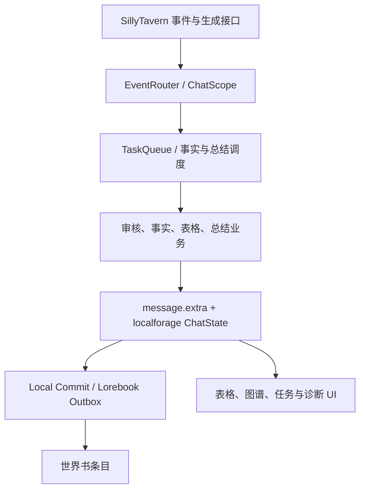
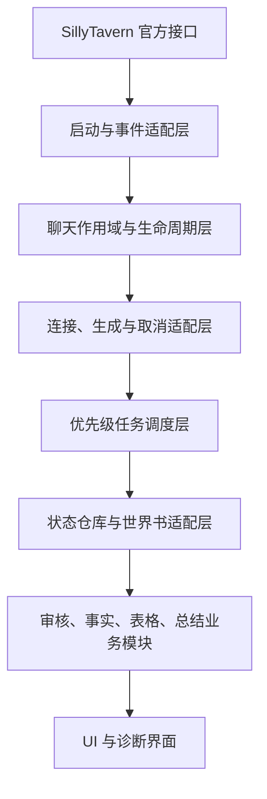

# Mirror Abyss 基础内核参考矩阵与迁移研究报告

> 状态：静态研究基线，不包含运行时代码修改
>
> 研究日期：2026-07-15
>
> 镜渊分支：`fix/api-wait-latency`
>
> 镜渊运行时版本：`1.1.0-alpha.10.7.10`
>
> 镜渊代码基线：`c29486b`（API 等待可观测性、优先级运输队列与有限并发测试版）
>
> SillyTavern 参考基线：官方仓库 `release` 分支与官方扩展文档

## 1. 结论

镜渊不需要推倒重写。当前代码已经具备几项应当保留的安全资产：聊天稳定 ID、`chatKey` 与 revision、任务取消、消息产物绑定、本地提交日志、世界书 Outbox、回读验证、条件回滚、跨标签页租约、迁移兼容和诊断导出。

真正需要逐层替换的是这些安全资产下面或旁边的基础设施接缝：

1. 用 SillyTavern 官方上下文、事件、生成和世界书能力作为默认入口。
2. 用一个适配层统一重新获取当前上下文，不让业务模块持有旧 `chatMetadata`。
3. 让一次异步工作从创建到完成始终携带同一份不可变聊天作用域与配置快照。
4. 把目前分散在 `TaskQueue`、事实调度器、总结调度器、世界书发布器和 Profile transport 中的调度责任逐步收束，但保留现有依赖顺序与幂等键。
5. 把本地状态重新定义为索引、任务日志、Outbox、回滚和诊断数据；记忆漏斗实施后，正文可用的长期记忆以世界书为唯一本体。

当前 `1.1.0-alpha.10.7.10` 的 API 等待修复符合这条方向：继续调用 `generateRaw` 或 `ConnectionManagerRequestService.sendRequest()`，不保存 API Key，不创建独立供应商客户端；但它仍是需要手机端验证的过渡实现，不应被视为基础内核迁移已经完成。

## 2. 本报告范围与证据等级

本报告完成了源码和文档静态核对，没有进行手机端 SillyTavern 实机运行、真实 API 压测或网络抓包。因此：

- “官方接口存在、参数形态、事件名称、缓存行为、许可证”属于已核实结论。
- “镜渊当前调用路径、数据边界和明显竞态”属于静态代码结论。
- “同 Profile 并发是否对所有模型、中转站和 SillyTavern 版本可靠”仍需实机验证。
- “阶段耗时、P50/P95、405/504 分布”只能由 `1.1.0-alpha.10.7.10` 的任务中心与诊断导出在真实环境采集，本报告不伪造测量值。
- 本次只新增研究文档，不迁移基础层，不实施记忆漏斗，不修改清理、世界书删除或聊天切换恢复代码。

## 3. 研究对象、版本与许可证边界

| 项目 | 本次核对版本/分支 | 许可证结论 | 本次允许使用方式 |
|---|---|---|---|
| [SillyTavern](https://github.com/SillyTavern/SillyTavern) | `release` 分支；官方仓库 | [AGPL-3.0](https://github.com/SillyTavern/SillyTavern/blob/release/LICENSE) | 第一优先级；直接调用公开上下文和官方接口。必要时研究实现细节以正确适配。 |
| Mirror Abyss | `1.1.0-alpha.10.7.10` | 仓库 `LICENSE` 为 AGPL-3.0 | 保留既有业务逻辑与安全机制，逐层迁移。 |
| [Memory Books](https://github.com/aikohanasaki/SillyTavern-MemoryBooks) | manifest `8.1.0` | [AGPL-3.0](https://github.com/aikohanasaki/SillyTavern-MemoryBooks/blob/main/LICENSE) | 可研究并在满足 AGPL、署名和源码义务时复用；本阶段只借鉴任务状态、聊天分区、Profile、结构化生成和世界书写入思想，不复制实现。 |
| [Qvink Message Summarize](https://github.com/qvink/SillyTavern-MessageSummarize) | manifest `1.3.29` | [AGPL-3.0](https://github.com/qvink/SillyTavern-MessageSummarize/blob/master/LICENSE) | 重点借鉴“摘要绑定具体消息”和编辑、删除、滑动后的局部失效；不复制其单文件结构、UI 或提示词。 |
| [ReMemory](https://github.com/InspectorCaracal/SillyTavern-ReMemory) | manifest `1.1.1` | [AGPL-3.0](https://github.com/InspectorCaracal/SillyTavern-ReMemory/blob/main/LICENSE) | 重点借鉴“世界书就是可编辑记忆本体”和使用官方世界信息能力；不采用固定请求间隔来替代优先级调度。 |
| [CharMemory](https://github.com/bal-spec/sillytavern-character-memory) | manifest `2.1.11` | 研究时仓库根目录未发现 `LICENSE`，manifest 也未声明许可证 | 版权默认保留；只能观察公开行为、文档中的模块边界和测试思想，禁止复制、改写或分发源码。其 per-chat isolation 文档属于设计稿，不能视为已验证实现。 |
| [Amily2](https://github.com/Wx-2025/ST-Amily2-Chat-Optimisation) | manifest `2.2.9` | [CC BY-NC-ND 4.0，并附加禁止二改发布条款](https://github.com/Wx-2025/ST-Amily2-Chat-Optimisation/blob/main/LICENSE) | 仅做黑盒行为和体验对比。禁止复制、改写、分发其 JS、HTML、CSS、提示词、命名和页面结构。 |

许可证兼容并不等于应当复制。镜渊的默认策略仍然是：先调用官方接口，其次借鉴可许可项目的架构思想；只有在明确记录来源、必要性、许可证义务和测试边界后，才考虑小范围代码复用。

## 4. 已核实的 SillyTavern 官方能力

主要依据为[官方扩展开发文档](https://docs.sillytavern.app/for-contributors/writing-extensions/)、[`events.js`](https://github.com/SillyTavern/SillyTavern/blob/release/public/scripts/events.js)、[`st-context.js`](https://github.com/SillyTavern/SillyTavern/blob/release/public/scripts/st-context.js)、[`extensions.js`](https://github.com/SillyTavern/SillyTavern/blob/release/public/scripts/extensions.js)、[`extensions/shared.js`](https://github.com/SillyTavern/SillyTavern/blob/release/public/scripts/extensions/shared.js)、[`custom-request.js`](https://github.com/SillyTavern/SillyTavern/blob/release/public/scripts/custom-request.js) 和 [`world-info.js`](https://github.com/SillyTavern/SillyTavern/blob/release/public/scripts/world-info.js)。

| 能力 | 官方入口 | 已核实行为 | 镜渊采用边界 |
|---|---|---|---|
| 扩展生命周期 | manifest hooks：`activate/install/update/delete/clean/enable/disable`；`APP_INITIALIZED`、`APP_READY` | hook 可返回 Promise，官方以约 5 秒上限等待并捕获错误；`APP_READY` 适合延后启动非阻塞工作 | 启停、事件安装和 UI 挂载走官方生命周期；耗时恢复链不放进同步 `activate`。 |
| 当前上下文 | `SillyTavern.getContext()` | 提供当前聊天、`chatMetadata`、事件、消息、生成、token、世界书、设置和服务；官方文档明确禁止长期保存 `chatMetadata` 引用 | 每次边界操作重新获取；异步任务使用自己的不可变 scope，不把新 context 当作旧任务目标。 |
| 聊天与消息事件 | `eventSource`、`eventTypes`/兼容别名 `event_types` | 包含 `CHAT_CHANGED`、`CHAT_LOADED`、消息创建/编辑/删除/滑动、生成开始/停止/结束、`WORLDINFO_UPDATED` 等 | 仅启动适配层直接监听；业务模块订阅镜渊内部规范化事件。 |
| 当前连接生成 | `generateRaw`、`generateRawData` | 使用 SillyTavern 当前连接，不要求插件保存密钥 | 保留为“当前连接”模式；排队任务需记录配置指纹和实际发送时间。 |
| Connection Profile 生成 | `ConnectionManagerRequestService.sendRequest()` | 按 Profile ID 解析连接；支持 `stream`、`AbortSignal`、preset/instruct 控制；流式结果为 AsyncGenerator 工厂 | Profile 模式唯一入口；完整聚合后再解析业务 JSON；兼容失败最多降级一次。 |
| 原生流式与取消 | `ChatCompletionService`、`TextCompletionService`；`sendRequest(..., signal)` | fetch 接收 AbortSignal；流式生成器持续返回累积文本、swipes 和 state | 统一 generation adapter 负责聚合、首字节计时、取消分类，不让业务模块直接消费流。 |
| 扩展设置 | `extensionSettings`、`saveSettingsDebounced()` | 适合 JSON 配置；官方建议不要存放大型数据集 | 只保存用户配置和轻量 schema 版本，不保存业务记忆或密钥。 |
| 聊天元数据 | `chatMetadata`、`saveMetadata()`/`saveMetadataDebounced()` | chat 切换后引用会更换；官方 debounced 保存会再次取 context 并检查 group/character，但不会替代镜渊的 chatKey/revision 校验 | 存放 chat instance ID、轻量 portable envelope 和绑定信息；每次写前校验同一作用域。 |
| 大型本地数据 | `SillyTavern.libs.localforage` | 官方共享的 IndexedDB/localStorage 抽象 | 继续保存 Outbox、提交日志、任务历史、回滚和诊断；按 account/chatKey 分区。 |
| 消息操作 | context 中的 `chat`、`saveChat`、`updateMessageBlock`、`deleteMessage`、重载和 swipe 相关函数 | 消息事件可用于精确失效，消息对象可承载扩展 `extra` 数据 | 继续把产物绑定消息，并通过官方事件驱动失效；不直接修改正文生成逻辑。 |
| 世界书读取与保存 | `loadWorldInfo()`、`saveWorldInfo()`、`updateWorldInfoList()`、`reloadWorldInfoEditor()`；官方模块的 `createWorldInfoEntry()` | `loadWorldInfo` 优先走官方 cache 并返回深拷贝；`saveWorldInfo` 会更新 cache、保存并发出 `WORLDINFO_UPDATED`；保存后不得继续修改同一对象 | 建立单一世界书适配器。保留镜渊 Outbox、幂等、回读验证和回滚，但不再绕过官方 cache 重复维护事件。 |
| UI 模板 | `renderExtensionTemplateAsync()` | 官方负责模板路径、清理与本地化；同步版本已弃用 | 新 UI 只走异步模板；已有 fallback 只作兼容降级。 |

注意：官方 `saveMetadataDebounced()` 只比较 group/character，不能证明同一角色下仍是同一个聊天；官方世界书保存接口也不提供镜渊业务所需的事务、幂等、回读和条件回滚。因此这些安全能力仍必须由镜渊保留在官方接口之上。

## 5. 镜渊当前数据与调用关系

现状中 `message.extra`、`ChatState.smallSummaries`、`largeSummaries`、`eventEntries` 和世界书条目都承载了一部分可用事实，因此还没有达到“世界书是唯一正文记忆本体”。这些结构不能在基础内核迁移时直接删除：先把它们降级为索引、来源关系、回滚和兼容数据，再由后续记忆漏斗阶段逐步完成单一真相迁移。

## 6. 参考矩阵 A：镜渊现状、问题与官方接口

| 基础模块 | 镜渊当前实现 | 当前问题/风险 | SillyTavern 官方实现与可直接调用接口 |
|---|---|---|---|
| 1. 插件启动与销毁 | manifest hooks、`APP_READY`、`lifecycleEpoch`、统一 `teardownRuntime()`；会取消任务并解绑路由和 UI | 启动同时有 hook、APP_READY 和 fallback timer 三条入口，虽有状态保护但责任重叠；`clean` 当前会清空全部镜渊存储，必须作为单独高风险任务审计 | manifest lifecycle hooks；`APP_INITIALIZED`/`APP_READY`；`eventSource.removeListener()`；`renderExtensionTemplateAsync()` |
| 2. 聊天作用域 | accountStorage 实例 ID、chat instance ID、`chatKey`、revision、alias 迁移和 stale/cancel 类型 | 聊天切换后的 Promise 恢复链没有绑定同一 scope；迁移、历史检测、焦点修复、Outbox 恢复会在步骤间重新读取“当前聊天” | 每次调用 `getContext()` 获取当前 `chatMetadata`；监听 `CHAT_CHANGED`/`CHAT_LOADED`；用 `saveMetadata()` 持久化轻量身份 |
| 3. 事件路由 | `EventRouter` 集中监听并规范化事件；业务管线大多订阅内部事件 | 路由事件的 scope 是 invalidate 后的当前值，但恢复任务没有消费这一快照；未规范化 `CHAT_LOADED`；异步订阅者是 fire-and-forget，缺少统一所有者和取消句柄 | `eventSource`；`eventTypes`/`event_types`；官方消息、聊天、生成和世界书事件 |
| 4. API 请求封装 | 当前连接走 `generateRaw`；Profile 走 `ConnectionManagerRequestService`；流式完整聚合，兼容失败一次性退回非流式；不保存密钥 | 当前连接模式无法冻结完整连接配置；Profile 兼容性和有限并发仍需实机验证；运输调度仍是镜渊自建层 | `generateRaw`；`ConnectionManagerRequestService.sendRequest()`；`ChatCompletionService`/`TextCompletionService` |
| 5. 任务调度 | `TaskQueue` lane、`UnifiedFactScheduler`、派生总结调度、世界书发布调度、Profile transport 优先级队列 | 多层队列造成等待原因和所有权分散；本次 API 补丁只优化真实请求入口，尚未形成单一依赖图；有限并发为测试策略 | 官方只负责单次请求，不提供镜渊业务优先级、依赖或幂等调度；这部分应由镜渊保留并收束 |
| 6. 取消与超时 | 每个任务 `AbortController`；Profile 请求传 signal；stale/cancelled 分开；页面重载把运行任务标记 stale | 模型 `timeoutMs` 当前为 0，缺少统一可配置 deadline；部分恢复/存储函数允许无 signal 调用；取消检查分散 | 官方生成请求支持 AbortSignal，另有生成停止事件；业务 deadline、取消传播和 stale 分类仍由镜渊负责 |
| 7. 配置快照 | Profile 任务记录 ID、名称、API、模型和指纹，发送前检测 Profile 是否变化 | “当前连接”只记录模式，没有冻结模型/预设指纹；业务函数仍会在执行中多次读取实时 settings，排队后改设置可能混用 | `extensionSettings`；Connection Manager 的 `getProfile()`/`getSupportedProfiles()`；设置和 Profile 变更事件 |
| 8. 本地状态存储 | account/chatKey 分区的 localforage；`portableChatState` 镜像到聊天元数据；消息 artifact、任务、Outbox、提交和日志分表 | portable state 与 IndexedDB 可能形成第二套业务真相；bridge 只能写当前聊天，旧异步任务必须先做 scope 校验；记忆漏斗目标要求世界书成为正文真相 | `chatMetadata` 适合轻量 per-chat 状态；`SillyTavern.libs.localforage` 适合大型日志、缓存和事务辅助数据 |
| 9. 消息绑定 | artifact 写入 `message.extra[MODULE_NAME]`，使用 stable message ID、正文指纹和 messageKey；监听编辑、删除、swipe | 一些事件 payload 仍先解析成数组下标；历史变化多数升级为重建，局部失效粒度仍可改善；手机端编辑/滑动组合需回归 | 官方 message events；`chat`、`saveChat`、消息更新/删除/swipe/reload API |
| 10. 世界书验证与写入 | 动态导入官方 entry 模板，但读取/保存直接 POST `/api/worldinfo/*`；外层有 per-book 锁、跨标签租约、Outbox、回读、条件回滚 | 直接 POST 绕过官方 `worldInfoCache`，随后又手动发事件和刷新 UI，容易与官方缓存形成双轨；世界书适配责任混在业务管线 | `loadWorldInfo`、`saveWorldInfo`、`createWorldInfoEntry`、`updateWorldInfoList`、`reloadWorldInfoEditor`、`WORLDINFO_UPDATED` |
| 11. 失败恢复 | Local Commit、Lorebook Outbox、服务器指纹、回读验证、冲突状态、历史重建、启动恢复 | chat-switch 恢复链会重读 current chat；个别 recovery catch 会把 stale 统计成 failed；恢复步骤缺少统一 checkpoint/scope 参数 | 官方提供生命周期、当前 context 和事件，但不提供镜渊业务事务；现有 journal/Outbox 必须保留 |
| 12. 数据清理 | chat 级清理参数可保留 Outbox/commit/backup；`onClean()` 会执行全量清理 | 清理权限和范围风险高，且与插件管理界面的 “Clean extension data” 语义直接相关；本阶段明确不修改 | 官方 `clean`/`delete` hook 只提供时机，不替插件决定数据范围；镜渊必须自行提供预览、确认和备份 |
| 13. 日志和诊断 | 任务日志、操作日志、路由诊断、世界书校验、UI health；10.7.10 新增 queue/transport/first-byte/request/parse/persist/metadata/lorebook/total 计时，并脱敏 | 尚无手机端真实样本；非流式的 first-byte 实际等于完整响应；部分本地提交和世界书等待需要跨任务关联才能完整归因 | 官方事件与请求接口提供时间边界；`registerDebugFunction` 可挂诊断入口；具体遥测模型由镜渊负责 |
| 14. 页面刷新后的恢复 | APP_READY 后标记旧任务 stale，恢复迁移、local commit、历史一致性、焦点、Outbox 和 portable state | 恢复顺序硬编码在 bootstrap Promise 链中；没有统一快照和 AbortSignal；快速切换时旧链可能继续处理新聊天 | `APP_READY`、`CHAT_CHANGED`、`CHAT_LOADED`、每次 `getContext()`；官方只给触发点，镜渊负责可恢复状态机 |

## 7. 参考矩阵 B：成熟项目边界与镜渊采用方案

下表缩写：ST/MB/QM/RM 分别指 SillyTavern、Memory Books、Qvink Message Summarize、ReMemory，均为 AGPL-3.0；CM 指无许可证的 CharMemory；A2 指禁止演绎的 Amily2。

| 基础模块 | 成熟插件参考 | 可借鉴的架构思想 | 禁止复制/不采用内容 | 镜渊最终采用方案 |
|---|---|---|---|---|
| 1. 启动与销毁 | MB 的功能分文件和可选 job UI；CM 文档中的初始化分区 | 单一 bootstrap owner；所有 listener/timer/subscription 返回 disposer | CM 源码；任何插件整套启动代码或 UI | 官方 lifecycle adapter 负责一次启动/一次销毁；业务模块只暴露 start/stop，不直接碰 ST 生命周期 |
| 2. 聊天作用域 | MB job 保存 `chatRef`/`chatKey`；QM 的 per-chat 配置；CM 的隔离设计稿仅作问题参考 | 任务创建时冻结 chat identity，提交前重新验证 | CM 未获许可代码；把角色 ID 当聊天 ID；复制他人的全局 Profile 切换 | 保留镜渊 account/chat instance/revision，新增不可变 `ChatScopeSnapshot` 并贯穿恢复与任务链 |
| 3. 事件路由 | QM 用集中 chat-event handler 处理 edit/delete/swipe；MB 将 job 与聊天引用关联 | 只让适配层监听官方事件，内部发布强类型/规范化事件 | QM 单文件事件实现；插件间私有事件名和 DOM 结构 | `OfficialEventAdapter -> MirrorEventRouter`；事件包含 source、scope snapshot、目标聊天和 abort owner |
| 4. API 封装 | MB/Profile 管理与结构化 JSON；CM 的单一 dispatch 概念；A2 只比较发起时机和等待体验 | 所有模型调用经过一个 generation adapter；业务只提交请求规格 | CM/MB 的自建供应商客户端或密钥字段；A2 源码、提示词和全局 Profile 切换 | 只封装 `generateRaw` 和 `ConnectionManagerRequestService`；聚合流后解析；记录阶段耗时和脱敏路由指纹 |
| 5. 任务调度 | MB per-chat job store、状态机、AbortController、写 lane；QM 可配置并行摘要 | 明确 queued/running/cancelled/blocked/completed；依赖、优先级和并发槽集中配置 | 固定延时伪装调度；无限并发；照搬 MB job drawer | 一个优先级 scheduler 逐步接管模型任务；事实顺序、summary dependency、Outbox 独立发布保持原语义 |
| 6. 取消与超时 | MB 的任务 cancel 与 emergency stop；QM 的 stop sequence | 每个工作有 signal；取消和 stale 不是业务失败；finally 必须释放通道 | 仅用布尔 stop flag；取消后删除恢复标记；对正在写入的数据做粗暴中断 | `AbortSignal` 贯穿官方生成；统一 deadline policy；已发送世界书提交进入 verify-pending 而非假定失败 |
| 7. 配置快照 | MB/QM 的 Profile 配置与聊天锁定 | 任务创建时冻结业务配置、Profile ID/指纹、输出协议版本 | 复制 Profile UI/字段模型；保存 Base URL/API Key | `TaskConfigSnapshot` 只保存非敏感引用与指纹；执行中不重新读取会改变语义的 settings |
| 8. 本地状态 | QM 把摘要绑定消息；RM 把正文记忆放世界书；CM 使用 Data Bank/Vector Storage | 业务真相与事务辅助状态分开；大数据进 localforage | CM Data Bank 模型强行替代镜渊世界书模型；维持本地 summary 数组为第二正文真相 | 世界书为正文记忆本体；localforage 仅保存索引、来源、Outbox、回滚、任务和诊断；chatMetadata 保存轻量 envelope |
| 9. 消息绑定 | QM 每条摘要写入消息 `extra`，并同步 swipe extra；编辑/删除只影响关联记忆 | stable message identity + source fingerprint；事件驱动局部失效 | QM UI、宏、注入模板和单文件实现 | 保留镜渊 artifact/messageKey；逐步把历史重建范围缩小到受影响的 event/fact/summary 依赖子图 |
| 10. 世界书写入 | MB 调用官方 load/create/save；RM 直接以世界书作为用户可编辑记忆 | 使用官方缓存和事件；写前准备、写后回读、失败不先删旧内容 | 复制 MB entry 标记或 RM UI；无验证覆盖；把整本世界书发给模型 | `LorebookAdapter` 独占世界书修改；官方 API 在下，镜渊 Outbox、幂等、版本、回读和条件回滚在上 |
| 11. 失败恢复 | MB job 状态、聊天引用和写 lane；QM 消息级失效 | 恢复是可观察状态机，不把取消当数据失败 | 复制状态名称/UI；错误后清空队列或恢复标记 | 保留 local commit/Outbox/history registry；每个 recovery step 使用同一 scope 与 checkpoint，可重入且幂等 |
| 12. 数据清理 | CM README 对批量修改先备份的警告；RM/MB 的世界书可见性 | 预览、备份、明确范围、二次确认 | 任何自动跨聊天删除；把插件禁用等同于清数据 | 单独阶段设计 CleanupService；默认只读预览；不与 API、聊天竞态或记忆漏斗补丁混做 |
| 13. 日志与诊断 | MB job drawer；CM health checklist 和分层测试；QM debug mode | 用户能看到等待阶段、依赖和恢复状态；纯函数可单测 | 复制 UI/CSS；记录密钥、完整 prompt/response | 保留 10.7.10 telemetry，增加关联 ID、数据量/token 和安全脱敏；任务中心只显示镜渊独立 UI |
| 14. 刷新恢复 | MB job/chatRef 思路；QM 从消息附着摘要重建 UI | 持久日志与可重建 UI 分离；运行中任务刷新后转 stale | 假装恢复已丢失的网络请求；自动清除未决事务 | APP_READY 建立 `RecoveryCoordinator`；按 scope 恢复 local commit、history、focus、Outbox，任何 chat change 都取消旧 coordinator |

## 8. 目标基础内核分层

强制依赖规则：

- 业务模块不直接监听 SillyTavern 事件。
- 业务模块不直接调用 `generateRaw`、`sendRequest` 或模型供应商端点。
- 业务模块不直接保存或修改世界书。
- 业务模块不长期保存 `chatMetadata`、`chat` 或 context 引用。
- UI 不直接改业务状态，必须发出命令并读取 repository 投影。
- 下层可以返回不可变 DTO；上层不能向下传递可长期变异的 SillyTavern 原始对象。

## 9. 应保留与应替换的当前模块

### 9.1 应保留

- 审核、必要修正、事实提取、表格、小总结、大总结的现有业务语义与兼容数据。
- account/session 标识、chat instance ID、`chatKey`、revision 和 alias 迁移概念。
- `message.extra` artifact、stable message ID、source fingerprint 和消息级来源关系。
- 事实顺序、小总结依赖事实包、大总结依赖已提交小总结的约束。
- Local Commit、Lorebook Outbox、intent key、服务器回读、条件回滚和冲突状态。
- 跨标签页 lease、per-book 写互斥和“已发送但结果未知时进入 verify-pending”的原则。
- 任务取消、stale/cancelled/failed 区分、旧任务不写新聊天的目标语义。
- 旧版本迁移、数据兼容和恢复 bundle。
- 任务中心、阶段耗时、脱敏诊断和世界书一致性检查。

### 9.2 应逐层替换或封装

- 直接 `/api/worldinfo/get|edit` 调用：收口到官方优先的 `LorebookAdapter`，避免绕过官方 cache。
- 到处直接 `getContext()` 并读取 current chat：收口到 `OfficialContextGateway` 和显式 scope snapshot。
- `event_types`、raw payload 和业务订阅混杂：收口到 `OfficialEventAdapter`。
- `TaskQueue`、事实 scheduler、总结 scheduler 和 Profile transport 的重复调度责任：逐步合并为单一优先级调度控制面，底层 lane 只保留资源约束。
- 执行中读取实时设置：改为任务创建时的 `TaskConfigSnapshot`。
- `ChatState` 中作为正文真相的 summary/event 副本：在记忆漏斗阶段逐步降级为世界书索引与重建元数据，不能本阶段直接删除。
- bootstrap 中手写的 Promise 恢复链：改为可取消、可检查点、显式作用域的 `RecoveryCoordinator`。

## 10. 哪些问题可由官方接口解决

| 当前问题 | 官方能力 | 官方接口能解决的部分 | 镜渊仍需负责的部分 |
|---|---|---|---|
| 旧 `chatMetadata` 引用 | `getContext()` 与官方文档约束 | 每次重新取得当前引用 | 任务自己的旧聊天快照、revision 和提交前校验 |
| 聊天/消息事件散落 | `eventSource`、完整 event types | 统一可靠的事件来源 | 规范化 payload、事件所有者、业务依赖顺序 |
| 独立 Profile 与密钥管理 | `ConnectionManagerRequestService` | Profile 解析、密钥引用、请求构造 | 优先级、并发槽、重试、遥测和业务 JSON 解析 |
| 流式与取消 | 原生 service + AbortSignal + AsyncGenerator | 运输、SSE 解析、取消 fetch | 完整聚合、一次降级、取消分类和 stale 校验 |
| 设置保存 | `extensionSettings` + debounced save | 配置持久化 | schema migration、配置快照和敏感字段禁止规则 |
| 大型浏览器状态 | `libs.localforage` | 稳定存储后端 | account/chat 分区、幂等、清理范围和迁移 |
| 世界书缓存和 UI 同步 | `loadWorldInfo`/`saveWorldInfo`/官方事件 | cache、标准条目和 UI 通知 | Outbox、compare-and-verify、回滚、同源覆盖 |
| 消息编辑/删除/滑动 | 官方 message events 和 message API | 精确变化信号 | 依赖图、局部失效和重建范围 |
| 扩展启停 | manifest hooks、APP lifecycle | 官方调用时机和错误隔离 | 资源所有权、取消任务、幂等初始化和安全清理 |

官方接口不能替代镜渊的聊天 revision、任务优先级、事实顺序、总结依赖、世界书事务、记忆漏斗、Outbox 和诊断。这些是镜渊基础内核的独立价值，应保留在官方能力之上。

## 11. 推荐迁移顺序与每阶段退出条件

1. **参考矩阵与测试基线**（本报告）

   冻结当前行为、版本、静态测试和诊断字段；不改业务。

2. **连接、生成与取消适配层**

   当前 `1.1.0-alpha.10.7.10` 已提供过渡实现。退出条件是手机端验证当前连接、Profile、流式、一次降级、取消、错误后 lane 释放和敏感信息脱敏。

3. **优先级任务调度层**

   先验证 10.7.10 的事实插队和有限并发，再决定是否保留同 Profile 并发 2；如果供应商/中转不安全，收敛为单真实请求的优先级队列，不删除锁。退出条件是事实不被未开始的大总结长期阻塞，且无重复总结/事实/世界书条目。

4. **聊天作用域与事件路由层**

   为 chat-switch 恢复建立不可变 snapshot 和 AbortController；加入 `CHAT_LOADED` 兼容；业务只收规范化事件。退出条件是快速 A→B→A 切换时，旧链只产生 stale/cancelled，不修改目标外聊天，也不清除未决标记。

5. **统一状态仓库**

   明确 chatMetadata、message.extra、localforage 和世界书的所有权；本地业务副本先变为投影/索引，不删除旧字段。退出条件是重载、迁移和旧版本聊天均可读取，且不存在跨聊天键写入。

6. **统一世界书适配层**

   官方 load/create/save 为默认，镜渊事务在外层；完成 cache、事件、回读和 rollback 合同测试。退出条件是写入失败不丢旧条目、第三方修改不被覆盖、Outbox 可恢复。

7. **业务模块拆分与记忆漏斗阶段**

   最后才让审核、事实、表格、小总结、大总结只依赖稳定内核，并按单独需求逐步把世界书确立为唯一正文记忆本体。

每一阶段均使用独立分支、测试版本和单个安装 ZIP；手机端确认前不合并稳定分支，也不提前开始下一层。

## 12. 下一阶段最小改动建议

在 `1.1.0-alpha.10.7.10` 完成手机端 API 等待验收后，下一项应回到独立分支 `fix/chat-switch-scope-race`，只处理聊天切换恢复竞态：

1. `CHAT_CHANGED`/`CHAT_LOADED` 到达时捕获不可变 `ChatScopeSnapshot`，至少包括 account/session ID、chatKey、chat instance ID、revision、raw target chat ID 和捕获时间。
2. 为每次切换创建独立 AbortController；新切换只取消旧 coordinator，不锁住用户切换。
3. 把同一个 snapshot 和 signal 传给 scope migration、legacy migration、local commit recovery、history consistency、deferred memory resume、focus repair、Outbox recovery、portable state restore 和最后的 worldbook verify。
4. 每次 await、服务器调用、存储写入和业务提交前后执行统一 `assertScopeSnapshot()`。
5. scope 变化时记录 `stale`/`cancelled`，保留旧聊天的待重建、Outbox 和恢复标记；不得进入 failed 清理路径。
6. 本分支不同时替换世界书 API、不调整清理、不重做状态仓库，也不实施记忆漏斗。

这是当前风险最高、边界最清楚、又能保持最小补丁的下一步。

## 13. 基线测试与实机待验证项

后续每个迁移分支至少执行：

- `node --check index.js`
- ES Module 导入烟雾测试
- `git diff --check`
- manifest、运行时 `VERSION` 与 `BUILD_INFO` 一致性
- 搜索所有 `getContext/currentChatKey/chatMetadata/sendRequest/generateRaw/worldinfo` 调用点
- 成功、失败、取消、stale 四条路径的 finally/通道释放检查
- ZIP 根目录的 `manifest.json`、入口、导入和资源路径检查

当前仍需手机端实机验证：

- 同一 Profile 最大并发 2 是否对当前 SillyTavern、模型和中转站可靠。
- Profile 流式 AsyncGenerator 是否稳定；一次性非流式降级是否不会造成重复业务提交。
- 事实提取能否越过未开始的大总结，以及大总结运行时等待原因是否准确显示。
- 首字节、完整响应、解析、持久化、元数据和世界书等待计时在移动端是否完整。
- 页面重载、网络中断、取消和 API 失败后 transport lane 是否始终释放。
- 快速切换聊天的恢复竞态尚未在本分支修复，必须由后续独立分支处理。

## 14. 明确的非结论

- 没有证据支持复制任何成熟插件的整体架构或 UI。
- 没有实机数据支持把并发 2 永久冻结为默认值。
- 没有完成容量测量，不能在本报告中决定记忆漏斗的总格数、单句长度或 token 安全值。
- 没有验证 CharMemory 的 per-chat isolation 已投入生产；其公开设计稿不能作为已通过方案。
- 没有检查或复用 Amily2 源码；其许可证决定了镜渊只能做行为对比。
- 没有授权在本阶段删除现有 queue、Outbox、revision、portable state、summary/event 兼容数据或世界书条目。

## 15. 主要研究链接

- SillyTavern：[扩展开发文档](https://docs.sillytavern.app/for-contributors/writing-extensions/)、[事件定义](https://github.com/SillyTavern/SillyTavern/blob/release/public/scripts/events.js)、[上下文导出](https://github.com/SillyTavern/SillyTavern/blob/release/public/scripts/st-context.js)、[生命周期与元数据保存](https://github.com/SillyTavern/SillyTavern/blob/release/public/scripts/extensions.js)、[Connection Manager 请求服务](https://github.com/SillyTavern/SillyTavern/blob/release/public/scripts/extensions/shared.js)、[流式/非流式请求](https://github.com/SillyTavern/SillyTavern/blob/release/public/scripts/custom-request.js)、[世界书实现](https://github.com/SillyTavern/SillyTavern/blob/release/public/scripts/world-info.js)。
- Memory Books：[README](https://github.com/aikohanasaki/SillyTavern-MemoryBooks/blob/main/readme.md)、[任务状态与聊天分区](https://github.com/aikohanasaki/SillyTavern-MemoryBooks/blob/main/stmbJobs.js)、[官方世界书接口使用](https://github.com/aikohanasaki/SillyTavern-MemoryBooks/blob/main/addlore.js)。
- Qvink Message Summarize：[README](https://github.com/qvink/SillyTavern-MessageSummarize/blob/master/README.md)、[消息绑定与事件处理](https://github.com/qvink/SillyTavern-MessageSummarize/blob/master/index.js)。
- CharMemory：[README](https://github.com/bal-spec/sillytavern-character-memory/blob/master/README.md)、[架构说明](https://github.com/bal-spec/sillytavern-character-memory/blob/master/docs/architecture.md)、[per-chat isolation 设计稿](https://github.com/bal-spec/sillytavern-character-memory/blob/master/docs/plans/2026-03-06-per-chat-isolation-revised.md)。
- ReMemory：[README](https://github.com/InspectorCaracal/SillyTavern-ReMemory/blob/main/README.md)。
- Amily2：[README](https://github.com/Wx-2025/ST-Amily2-Chat-Optimisation/blob/main/README.md)、[许可证](https://github.com/Wx-2025/ST-Amily2-Chat-Optimisation/blob/main/LICENSE)。
